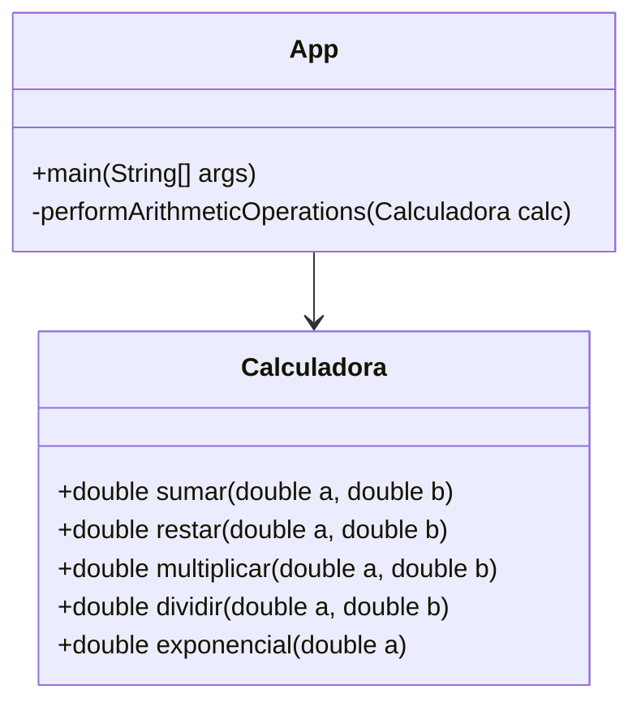
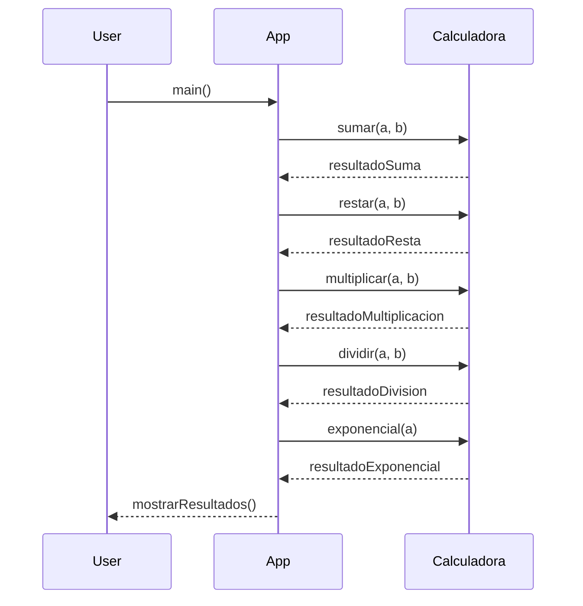

# My Project

This is a basic Java Maven project with a package `miPrincipal`.

## Project Structure

```
mi-proyecto
├── src
│   ├── main
│   │   ├── java
│   │   │   └── miPrincipal
│   │   │       └── App.java
│   │   └── resources
│   └── test
│       ├── java
│       │   └── miPrincipal
│       │       └── AppTest.java
│       └── resources
├── pom.xml
└── README.md
```

## Usage

To run the application, execute the `App` class in the `miPrincipal` package.

To run the tests, execute the `AppTest` class in the `miPrincipal` package.

## Dependencies

This project uses Maven for dependency management. The dependencies are defined in the `pom.xml` file.

## Diagrama de Clases



## Diagrama de Secuencia


## License

This project is licensed under the [MIT License](LICENSE).
```

Please let me know if you need any further assistance.
